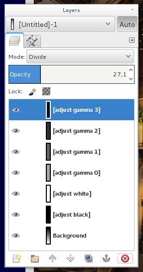

# GIMP plug-in for a fake adjustment layer

This is a proof-of-concept GIMP plug-in that creates a Photoshop-like color
adjustment layer in GIMP 2.8.

This is highly experimental. Use at your own risk. Comments and improvements
are welcome.

A recent version of Scipy and Numpy is required (note that GIMP uses the old
Python 2.7, so use pip2.7 to install).

After installing the plug-in, check the menu option "Layer -> Fake adjustment".

The black point, white point and gamma settings are identical to the Color
Levels dialog.

More documentation might come eventually. This [blog post](https://www.tablix.org/~avian/blog/archives/2018/03/faking_adjustment_layers_with_gimp_layer_modes/) explains how the plug-in works.

## License

GIMP fake adjustment layer plug-in is Copyright (C) 2018 Tomaž Šolc tomaz.solc@tablix.org

This program is free software: you can redistribute it and/or modify it under
the terms of the GNU General Public License as published by the Free Software
Foundation, either version 3 of the License, or (at your option) any later
version.

This program is distributed in the hope that it will be useful, but WITHOUT ANY
WARRANTY; without even the implied warranty of MERCHANTABILITY or FITNESS FOR A
PARTICULAR PURPOSE.  See the GNU General Public License for more details.

You should have received a copy of the GNU General Public License along with
this program.  If not, see http://www.gnu.org/licenses/
